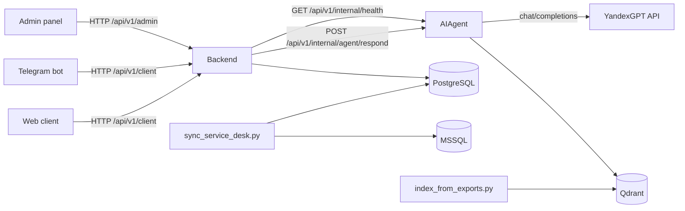

# Project Architecture And ML

Этот документ описывает только то, что реально есть в коде репозитория `business-hack-1`.
Если какая-то часть зависит от флага окружения или запускается вручную, это указано отдельно.

## 1. Что это за система

Сервис состоит из нескольких отдельных компонентов:

- `backend` — основной FastAPI backend для admin API и client API.
- `ai-agent` — отдельный FastAPI сервис, который делает retrieval, принимает решение `answer/clarify/escalate` и при необходимости генерирует ответ через YandexGPT.
- `postgres` — основная operational database backend.
- `mssql` — источник legacy/service-desk данных, который поднимается из `data/cleaned.bak`.
- `qdrant` — vector database для `ai-agent`.
- `telegram-bot` — отдельный бот, который работает только через backend API.

Frontend в `docker-compose.yml` не запускается. В репозитории есть `frontend`, но текущая compose-топология для runtime включает backend, ai-agent, PostgreSQL, MSSQL, Qdrant и Telegram bot.

## 2. Общая архитектура

## 3. Что делает каждый сервис

### 3.1 Backend

`backend` — это главный API сервиса.

Он отвечает за:

- JWT-аутентификацию пользователей и администраторов.
- хранение пользователей, заявок, сообщений, документов, метрик и assistant settings в PostgreSQL;
- client API для web и Telegram;
- admin API для операторов и настроек ассистента;
- вызов `ai-agent` по HTTP;
- сохранение ответа ассистента в переписку заявки.

Основные runtime-маршруты:

- `/api/v1/admin/...`
- `/api/v1/client/...`

### 3.2 AI Agent

`ai-agent` — это отдельный сервис inference/RAG.

Он отвечает за:

- embedding пользовательского запроса через локальную embedding model;
- поиск похожих кейсов и статей в Qdrant;
- rerank найденных кейсов;
- decision logic: `answer`, `clarify`, `escalate`;
- генерацию финального текста ответа через YandexGPT;
- fallback на шаблонный ответ по `resolution_text`, если генератор не сконфигурирован или не вернул текст.

Основной внутренний endpoint:

- `/api/v1/internal/agent/respond`

Health endpoint:

- `/api/v1/internal/health`

### 3.3 PostgreSQL

`PostgreSQL` — основная база backend.

В ней хранятся:

- `users`
- `tickets`
- `messages`
- `documents`
- `metrics`
- `assistant_settings`

### 3.4 MSSQL

`MSSQL` поднимается из backup-файла `data/cleaned.bak`.

Он используется как источник service-desk данных:

- тикеты читаются через `ServiceDeskMssqlReader`;
- документы базы знаний тоже читаются из MSSQL;
- данные затем могут быть синхронизированы в PostgreSQL отдельным batch-скриптом.

Важно: backend request path не ходит в MSSQL на каждый пользовательский запрос. MSSQL нужен как источник данных, а не как online DB для client API.

### 3.5 Qdrant

`Qdrant` хранит векторные данные для `ai-agent`.

Используются две коллекции:

- `ticket_cases`
- `article_chunks`

В payload точек хранятся метаданные, которые дальше используются в retrieval и rerank.

### 3.6 Telegram Bot

`telegram-bot` не обращается напрямую ни в PostgreSQL, ни в Qdrant, ни в `ai-agent`.

Он работает только через backend API:

- регистрация/логин пользователя;
- получение профиля;
- создание заявки;
- отправка нового сообщения в заявку;
- просмотр списка заявок.

## 4. Как работает backend

## 4.1 Startup backend

При запуске backend:

1. применяет Alembic migrations;
2. создает FastAPI app;
3. проверяет схему базы;
4. инициализирует базовое состояние;
5. при необходимости создает admin user и default assistant settings;
6. подключает admin и client routers;
7. включает CORS middleware.

Что важно:

- migrations вызываются в `backend/serve.py`;
- внутри `create_app()` есть отдельная логика `run_migrations_on_startup`, но даже если этот флаг выключен, `serve.py` все равно применяет migrations перед стартом сервера.

## 4.2 Auth

Backend использует один JWT-механизм на `HS256`.

В токен кладется `sub = user_id`.

Роли не зашиваются в токен отдельным claim. Проверка admin/client делается после загрузки пользователя из базы:

- admin endpoints требуют `is_admin=True`;
- client endpoints работают через обычного пользователя.

Есть отдельный Telegram login flow:

- endpoint `/api/v1/client/auth/telegram/login`;
- он требует заголовок `X-Telegram-Bot-Token`;
- token в заголовке должен совпадать с backend-настройкой `telegram_bot_token`.

## 4.3 Client API

Client API обслуживает и web, и Telegram.

Основные возможности:

- регистрация;
- логин;
- Telegram login для уже связанного аккаунта;
- получение текущего профиля;
- создание заявки;
- получение списка своих заявок;
- получение одной заявки;
- отправка нового сообщения в уже существующую заявку.

При создании заявки backend:

1. создает `Ticket`;
2. создает первое `Message` от пользователя;
3. коммитит их в PostgreSQL;
4. вызывает `ai-agent`;
5. сохраняет ответ ассистента как второе сообщение.

При добавлении нового сообщения в существующую заявку backend:

1. проверяет, что заявка существует и принадлежит пользователю;
2. запрещает писать в закрытую заявку;
3. сохраняет новое сообщение;
4. снова вызывает `ai-agent`;
5. сохраняет новый assistant reply.

## 4.4 Admin API

Admin API отвечает за:

- login администратора;
- получение текущего admin profile;
- dashboard summary и графики;
- просмотр очереди обращений;
- работу с деталями обращений;
- assistant settings.

Assistant settings, которые реально влияют на AI flow из backend:

- `tone_of_voice`
- `confidence_threshold`
- `top_k`
- `use_articles`

Эти значения хранятся в PostgreSQL и передаются в `ai-agent` в payload каждого запроса.

## 4.5 Что backend сохраняет из AI ответа

Backend вызывает `ai-agent` через HTTP client `AiAgentService`.

После ответа `ai-agent` backend использует:

- `message`
- `should_escalate`

Дальше backend:

- создает новое assistant message;
- ставит `ticket.assistant_resolved = not should_escalate`;
- ставит `ticket.scope = "assistant"` или `"ticket"`.

Важно: backend не сохраняет в `messages` такие поля ответа `ai-agent`, как:

- `confidence`
- `citations`
- `mode`
- `ticket_draft`

То есть часть структурированного результата используется только в runtime и не записывается в основную таблицу сообщений.

## 5. Что в проекте является ML

В этом проекте ML-часть — это не обучение собственной модели.

Реально в коде есть:

- embedding пользовательских запросов;
- векторный поиск по историческим кейсам и статьям;
- heuristic reranking;
- decision logic на основе score и payload;
- LLM generation через внешний API YandexGPT.

То есть это RAG/inference pipeline, а не training pipeline.

### 5.1 Чего в проекте нет

В репозитории нет:

- обучения собственной нейросети;
- fine-tuning модели;
- online-learning;
- автоматического переобучения по новым заявкам;
- feature store;
- модели-классификатора, которая отдельно обучается в runtime backend.

## 6. Как работает ML / AI pipeline

### 6.1 Вход в AI pipeline

Backend передает в `ai-agent` payload со следующими полями:

- `appeal_id`
- `message_id`
- `employee_login`
- `user_text`
- `history`
- `settings`

В `settings` приходят runtime-настройки из backend DB:

- `tone_of_voice`
- `confidence_threshold`
- `top_k`
- `use_articles`

### 6.2 Router mode

`ai-agent` сначала определяет режим обработки:

- `create_ticket`
- `resolve_issue`

Это делается не отдельной ML-моделью, а rule-based логикой в `ModeRouter`.

То есть выбор режима строится по regex/эвристикам в тексте запроса.

### 6.3 Embeddings

Для поиска по Qdrant используется локальная embedding model:

- `Qwen/Qwen3-Embedding-0.6B` по умолчанию

Embedding вычисляется локально внутри `ai-agent` через `QwenEmbeddingService`.

Это не внешний embedding API.

### 6.4 Retrieval

`RetrievalService` делает ticket-first retrieval.

Что происходит:

1. пользовательский текст нормализуется;
2. из него извлекаются hints по доменам, например:
   - `1с`
   - `отчет`
   - `всд`
   - `принтер`
   - `удаленка`
   - `vpn`
   - `доступ`
   - `почта`
3. строится до двух query-вариантов;
4. каждый query embedding-ится;
5. выполняется поиск по `ticket_cases` в Qdrant;
6. результаты мерджатся и сортируются.

Если `use_articles=True` и верхний ticket не выглядит достаточно сильным, `ai-agent` дополнительно ищет статьи в `article_chunks`.

### 6.5 Vector storage

Qdrant используется как основное online storage для retrieval.

Коллекции:

- `ticket_cases`
- `article_chunks`

Vector distance:

- cosine similarity

В Qdrant payload сохраняется `point_id` и другие метаданные кейса/чанка.

### 6.6 Reranking

После retrieval запускается heuristic reranking.

Важно:

- reranking применяется к ticket results;
- articles отдельно не rerank-ятся этой логикой.

Rerank влияет на итоговый score, после которого дальше работает decision logic.

### 6.7 Confidence / decision logic

После retrieval и rerank `ConfidenceService` выбирает одно из решений:

- `answer`
- `clarify`
- `escalate`

Решение зависит от:

- score верхнего ticket;
- наличия ticket results;
- наличия article results;
- признаков конфликтности payload;
- флага `candidate_for_abstain`;
- порога `confidence_threshold`.

Это не отдельная обученная модель.
Это rule-based decision layer над retrieval score и payload.

### 6.8 Генерация ответа

Если `YandexGptClient` сконфигурирован, `AnswerService` формирует system prompt и user prompt и вызывает YandexGPT через OpenAI-compatible endpoint:

- `POST /chat/completions`

Используются:

- `YANDEX_GPT_API_KEY`
- `YANDEX_GPT_FOLDER_ID`
- `YANDEX_GPT_MODEL`
- `YANDEX_GPT_BASE_URL`

Если генератор не сконфигурирован или не вернул текст, `AnswerService` делает fallback:

- берет `resolution_text` из top ticket;
- формирует короткий шаблонный ответ.

### 6.9 Что именно отправляется в генератор

В prompt попадают:

- `tone_of_voice`
- исходный пользовательский запрос;
- контекст из top tickets;
- контекст из top articles;
- инструкции из prompt storage.

Контекст формируется из:

- `resolution_text`
- `chunk_markdown`
- `request_text`
- `title` / `service`

### 6.10 История сообщений

Backend отправляет `history` в payload.

Но важно:

- history есть в request schema;
- history передается из backend;
- в текущем `DialogOrchestrator` история не используется как полноценный источник retrieval/generation context.

То есть multi-turn state передается, но не играет полной роли в agent logic.

## 7. Offline data preparation и indexing

В проекте есть отдельная offline-часть подготовки данных для retrieval.

Смысл этого контура:

1. подготовить chunk-файлы;
2. посчитать embeddings;
3. загрузить точки в Qdrant.

Для этого есть CLI:

- `ai-agent/ai_agent/cli/index_from_exports.py`

Он:

- берет JSONL-файлы;
- считает embeddings через `QwenEmbeddingService`;
- создает коллекции в Qdrant при необходимости;
- загружает `ticket_cases` и `article_chunks` в Qdrant.

Это отдельный indexing flow.
Он не выполняется автоматически каждым запросом пользователя.

## 8. MSSQL -> PostgreSQL sync

В backend есть отдельный batch-скрипт:

- `backend/sync_service_desk.py`

Он:

1. применяет migrations;
2. открывает PostgreSQL session;
3. читает тикеты и документы из MSSQL;
4. преобразует их в internal projections;
5. upsert-ит их в PostgreSQL.

Это ручной/offline sync-путь.

Важно:

- это не отдельный постоянный worker в `docker-compose.yml`;
- это не cron внутри compose;
- это надо запускать отдельно.

## 9. Полный runtime flow одного пользовательского запроса

Ниже — фактический путь одного client request.

### 9.1 Web / Telegram -> Backend

Пользователь:

1. регистрируется или логинится;
2. отправляет текст заявки;
3. backend создает `Ticket` и `Message` в PostgreSQL.

Если это Telegram:

- сам bot только проксирует действия в backend;
- логика заявок остается в backend.

### 9.2 Backend -> AI Agent

Backend:

1. достает assistant settings из PostgreSQL;
2. формирует payload;
3. вызывает `POST /api/v1/internal/agent/respond`.

### 9.3 AI Agent внутри себя

`ai-agent`:

1. определяет mode;
2. делает embedding запроса;
3. идет в Qdrant;
4. получает похожие tickets;
5. при необходимости добирает article chunks;
6. rerank-ит ticket hits;
7. принимает решение `answer/clarify/escalate`;
8. генерирует текст через YandexGPT или fallback;
9. возвращает структурированный ответ backend.

### 9.4 Backend после ответа

Backend:

1. берет `message` и `should_escalate`;
2. создает assistant message;
3. обновляет состояние тикета;
4. возвращает клиенту уже обновленную заявку с сообщениями.

### 9.5 Если AI Agent недоступен

Если вызов `ai-agent` падает по HTTP/runtime error, backend:

- не ломает создание заявки;
- сохраняет заявку;
- добавляет fallback message:
  `Ассистент временно недоступен...`

То есть backend flow устойчив к падению AI части, но ответ в этом случае будет не интеллектуальный, а фиксированный.

## 10. Ограничения и точные caveats

Ниже только то, что действительно следует из кода.

### 10.1 AI orchestrator может быть выключен

`ai-agent` строит runtime orchestrator только если включен флаг:

- `AI_AGENT_ENABLE_ORCHESTRATOR=true`

Если он выключен, inference endpoint не сможет отработать полноценно.

### 10.2 AI Agent health и real inference — не одно и то же

В backend есть health-check до `ai-agent`, но наличие процесса еще не означает, что весь retrieval/generation path готов к работе.

### 10.3 History передается, но не полноценно используется

История сообщений есть в request payload, но в текущей orchestration logic она не используется как полноценный многоходовый контекст для retrieval и generation.

### 10.4 В backend не сохраняются citations и confidence

Структурированные поля ответа `ai-agent` не записываются целиком в основную таблицу сообщений backend.

### 10.5 В проекте нет training pipeline

В терминах презентации нельзя честно говорить, что проект:

- обучает свою ML-модель;
- дообучает LLM на лету;
- автоматически учится на каждой новой заявке.

Корректная формулировка:

- проект использует retrieval + embeddings + vector search + rule-based decision layer + external LLM generation.

### 10.6 Sync и indexing не автоматизированы как постоянные сервисы

И sync из MSSQL в PostgreSQL, и indexing в Qdrant реализованы как отдельные скрипты/CLI, а не как постоянные runtime worker-сервисы в compose.

## 11. Краткая формулировка для презентации

Если нужен один строгий абзац без маркетинга:

> Сервис построен как связка backend + ai-agent. Backend хранит пользователей, заявки, сообщения и runtime-настройки ассистента в PostgreSQL, отдает admin/client API и вызывает ai-agent по HTTP. AI-часть реализована как RAG-конвейер: локальная embedding model преобразует запрос в вектор, затем в Qdrant ищутся похожие historical ticket cases и article chunks, результаты проходят heuristic reranking, после чего rule-based confidence logic выбирает answer/clarify/escalate. Финальный текст генерируется через YandexGPT или строится из top ticket resolution_text как fallback. Telegram bot не содержит отдельной бизнес-логики и работает только через backend API. MSSQL используется как источник исходных service-desk данных, а синхронизация в PostgreSQL и indexing в Qdrant выполняются отдельными batch-скриптами.

