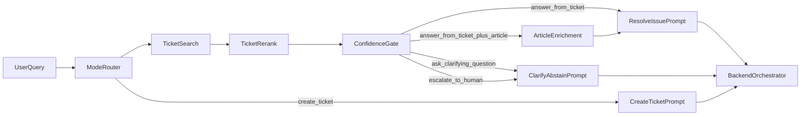

# RAG Hardening Design

## Goal
Довести `ai-agent` до исходного ticket-first RAG-дизайна из `research/data_preparation/ticket_first_rag_design.md`, чтобы сервис устойчиво решал две продуктовые задачи:

1. `resolve_issue`:
   безопасно отвечать по историческим тикетам и, при необходимости, по статьям базы знаний.
2. `create_ticket`:
   собирать качественный draft заявки с explainable hints для `Service`, `TaskType` и `Priority`.

Критерий успеха для первой волны:
- retrieval и rerank следуют ticket-first логике;
- prompt behavior grounded и explainable;
- есть устойчивый eval-контур для поиска, промптов и end-to-end решений;
- admin migration в `backend` не блокирует развитие RAG.

## Scope
В scope этой волны входят:

- internal RAG API в `ai-agent`;
- retrieval по `ticket_cases` и `article_chunks`;
- rerank и confidence gate;
- prompt strategy для `resolve_issue`, `create_ticket`, `clarify`, `abstain`;
- intake flow и classifier hints для `create_ticket`;
- evaluation и regression tests для retrieval, prompts и end-to-end behavior.

Не входят в scope:

- развитие admin API внутри `ai-agent`;
- UI и admin workflows;
- дополнительная backend orchestration logic;
- production-grade incremental indexing beyond current KISS path;
- sparse, hybrid, graph, multivector retrieval.

Текущий временный admin/demo слой в `ai-agent` замораживается и не влияет на архитектуру RAG-hardening. Другой агент переносит админку в `backend`.

## Design Principles
- Ticket-first: сначала ищем лучший решенный кейс, потом при необходимости добираем article context.
- KISS: никаких новых retrieval subsystems без измеримого failure mode.
- Better abstain than hallucinate.
- Prompts не должны компенсировать слабый retrieval.
- `create_ticket` должен опираться на те же retrieval signals, что и `resolve_issue`.
- Все выходы должны быть explainable через ticket ids, article chunks и citations.

## Current Gaps
Относительно `research/data_preparation/ticket_first_rag_design.md` текущий `ai-agent` недотянут в следующих местах:

- `ai-agent/ai_agent/services/retrieval_service.py` ищет почти по сырому query и слабо реализует controlled enrichment.
- `ai-agent/ai_agent/services/rerank_service.py` пока не отбирает кандидатов по достаточному числу explainable сигналов.
- `ai-agent/ai_agent/services/confidence_service.py` пока слишком упрощен для реального abstain/clarify behavior.
- `ai-agent/ai_agent/services/answer_service.py` и prompts пока не задают достаточно строгую grounded generation discipline.
- `create_ticket` пока не реализует полноценный intake flow с missing info detection и explainable classifier hints.
- Нет полного eval-контура, который системно проверяет retrieval, prompts и end-to-end outcomes.

## Architecture



## Retrieval Core

### Ticket Retrieval
Поиск начинается только в `ticket_cases`.

Для query construction используются:
- raw user query;
- normalized problem-first query;
- soft domain hints, если они явно видны в тексте (`vpn`, `удаленка`, `1с`, `отчет`, `доступ`, `почта` и т.д.).

Первичный embedding search должен по-прежнему быть centered around `request_text`, а не around `resolution_text`.

### Rerank
После initial dense search каждый ticket candidate оценивается не только по vector score, но и по explainable признакам:

- vector similarity;
- `resolution_quality`;
- `is_actionable`;
- штраф за `candidate_for_abstain`;
- rejection/cancel signals;
- overlap по `domain_tags`;
- overlap по `service`, `task_type`, `custom_fields`;
- overlap по ключевым сущностям user query;
- наличие достаточно полезного `resolution_text`.

Цель rerank:
- initial retrieval отвечает за recall;
- rerank отвечает за precision и safety.

### Confidence Gate
После rerank сервис обязан выбрать один из четырех исходов:

1. `answer_from_ticket`
2. `answer_from_ticket_plus_article`
3. `ask_clarifying_question`
4. `escalate_to_human`

Правила:
- strong и domain-consistent top ticket -> `answer_from_ticket`;
- useful, но короткий или бедный top ticket -> `answer_from_ticket_plus_article`;
- похожий, но пограничный результат -> `ask_clarifying_question`;
- weak, conflicting или non-actionable top ticket -> `escalate_to_human`.

### Controlled Article Enrichment
Статьи не ищутся blind second pass.

Для article search query строится enriched query из:
- raw user query;
- normalized problem statement;
- top ticket `service` / `task_type`;
- top ticket `domain_tags`.

Article retrieval служит для:
- пошаговой инструкции;
- подтверждения ticket answer;
- заполнения gaps в коротком `resolution_text`.

## Mode Design

### `resolve_issue`
Target behavior:
- найти лучший resolved case;
- проверить, что решение actionable и domain-consistent;
- при необходимости добрать article context;
- вернуть grounded answer с citations;
- если уверенности недостаточно, не фантазировать.

### `create_ticket`
Target behavior:
- нормализовать пользовательскую формулировку;
- определить missing info;
- задать максимум 1-2 уточняющих вопроса;
- собрать draft заявки;
- предложить `Service`, `TaskType`, `Priority` только как retrieval-backed recommendation;
- вернуть explainable evidence.

## Prompt Strategy

### `resolve_issue`
Framework baseline: `CARE` / `TIDD-EC`.

Prompt rules:
- отвечать только по предоставленному контексту;
- не использовать знания вне retrieval;
- не выдумывать шаги;
- давать citations;
- при низкой уверенности переходить в clarify/escalate.

### `create_ticket`
Framework baseline: `RISEN` / `RACE`.

Prompt rules:
- сначала нормализовать проблему;
- отдельно фиксировать missing info;
- предлагать classifier hints как recommendations;
- собирать пригодный для backend draft;
- не выдавать retrieval-free guesses за truth.

### `clarify`, `abstain`, `escalate`
Эти prompts должны жить отдельно и не сливаться с основными prompt family.
Это нужно, чтобы transitions между decisions были стабильными и проверяемыми.

## Output Contracts

### `resolve_issue`
Сервис должен возвращать:
- `decision`;
- `assistant_message`;
- `citations`;
- `confidence`;
- `top_ticket_ids`;
- `used_articles`;
- `retrieval_stats`.

### `create_ticket`
Сервис должен возвращать не только текст, но и структурированный draft:

```json
{
  "normalized_request": "...",
  "missing_fields": ["device", "system"],
  "clarifying_questions": ["..."],
  "suggested_service": "...",
  "suggested_task_type": "...",
  "suggested_priority": "...",
  "evidence_ticket_ids": [123, 456],
  "evidence_summary": "..."
}
```

## Evaluation Strategy

### Retrieval Eval
Нужен golden set из real-like queries, для которых проверяется:
- нужный ticket id попадает в top-k;
- unsafe candidates не проходят confidence gate;
- article enrichment включается только в уместных кейсах.

### Prompt Eval
Нужны regression cases на:
- grounded answer only;
- citations presence;
- correct abstain/clarify/escalate behavior;
- отсутствие retrieval-free classifier hallucinations;
- максимум 1-2 clarifying questions.

### End-to-End Eval
Для реальных сценариев проверяем:
- полезность final answer;
- explainability;
- корректность escalation;
- качество ticket draft;
- качество `Service` / `TaskType` / `Priority` hints.

## Test Layout
Service-owned quality контур должен жить внутри `ai-agent/tests`.

Рекомендуемая структура:
- `ai-agent/tests/test_retrieval_*.py`
- `ai-agent/tests/test_rerank_*.py`
- `ai-agent/tests/test_confidence_*.py`
- `ai-agent/tests/test_prompt_*.py`
- `ai-agent/tests/test_dialog_orchestrator.py`
- `ai-agent/tests/fixtures/*.json`

Golden fixtures должны включать:
- query;
- expected top ticket ids;
- expected decision;
- expected classifier hints;
- negative cases для abstain и cancel/rejection tickets.

## Implementation Order
Рекомендуемый порядок реализации:

1. Усилить retrieval core:
   `RetrievalService`, `RerankService`, `ConfidenceService`.
2. Довести `create_ticket` intake flow и classifier hints.
3. Переписать prompt family и context assembly.
4. Добавить retrieval eval и prompt regression suite.
5. После этого делать measured tuning по конкретным failure modes.

## Out of Scope for This Wave
- новая vector schema;
- sparse/hybrid retrieval;
- multivector;
- graph retrieval;
- dedicated reranker model;
- production-grade incremental indexing orchestration;
- admin migration details.

## Risks
- Prompt changes без retrieval hardening дадут красивый, но ненадежный output.
- Слишком агрессивный article enrichment размоет ticket-first path.
- Недостаточно строгий confidence gate будет поощрять hallucinations.
- `create_ticket` легко скатится в weak template filler без real retrieval grounding.
- Без eval quality будет обсуждаться субъективно.

## Decision
Первая волна RAG-hardening должна:
- игнорировать admin migration scope;
- фокусироваться на internal RAG API;
- balanced-way довести и `resolve_issue`, и `create_ticket`;
- опираться на ticket-first retrieval из research;
- завершиться не только кодом, но и repeatable eval контуром.
